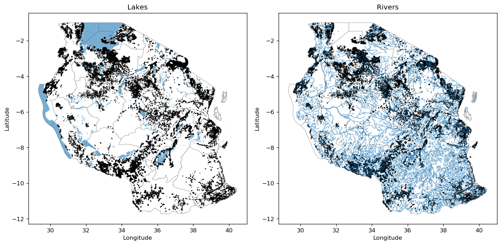
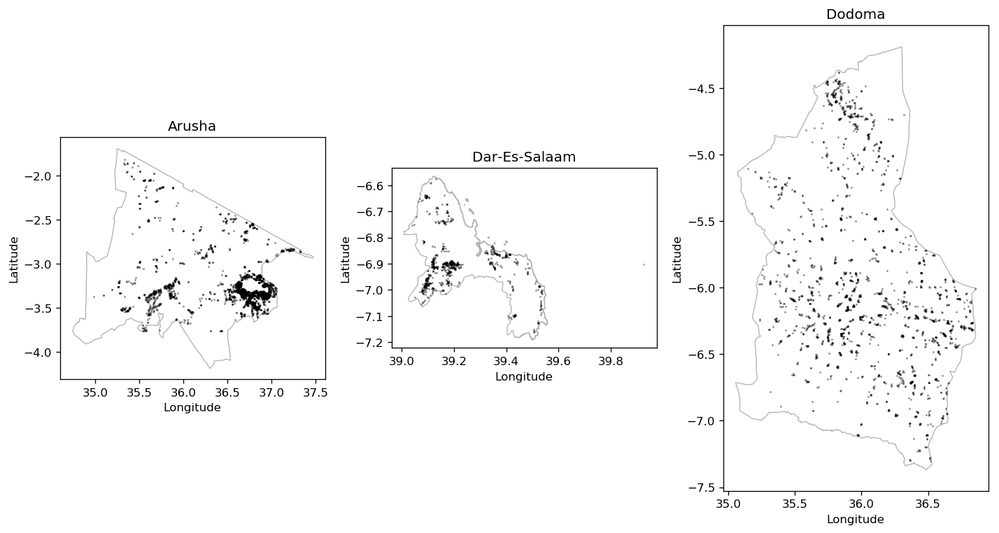
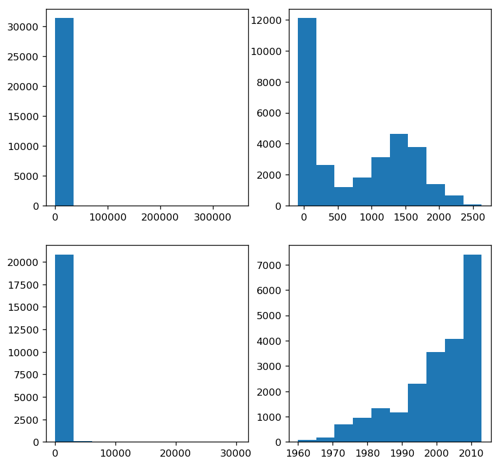

# The Pump it up challenge

**Pump it up** is a very interesting data science challenge available at [**DrivenData**](https://www.drivendata.org/competitions/7/pump-it-up-data-mining-the-water-table/).


# Software and packages

To reproduce these results you will need to have installed on your computer:

1. **Python**, with [**Jupyter**](https://jupyter.org/) notebook or an [**IPython**](https://ipython.org/) running terminal,
2. [**Numpy**](https://www.numpy.org/), [**Pandas**](https://pandas.pydata.org/) and [**Matplotlib**](https://matplotlib.org/),
3. [**GeoPandas**](http://geopandas.org/) for the geographical data manipulation and  
4. [**Shapely**](https://shapely.readthedocs.io/en/latest/) for the geometric objects manipulation


# Load and visualize dataset

First, go ahead and save the `training_set_labels.csv`, `training_set_values.csv` and `test_set_values.csv` files on your working directory.


```python
import numpy as np
import pandas as pd

def prepare_independent_vars(type='train'):
    #Load files into Pandas DataFrames
    if type=='train':
        filename1 = 'training_set_labels.csv'
        Y = pd.read_csv(filename1)
        filename2 = 'training_set_values.csv'
        dataX = pd.read_csv(filename2) 
        X = dataX.copy()
        
        #Remove some variables
        Y.drop(['id'], axis=1, inplace=True)
        remXcol = ['id','funder','date_recorded','wpt_name','num_private','subvillage','region','lga','ward','recorded_by',
                   'scheme_name','extraction_type','extraction_type_group','management_group','payment_type','quality_group',
                   'quantity_group','source','waterpoint_type']
        X.drop(remXcol, axis=1, inplace=True)

        #Replace missing/weird data with NaN
        X['population'].replace(0, np.NaN, inplace=True)
        X['construction_year'].replace(0, np.NaN, inplace=True)

        #Delete wrong data (Latitude/Longitude outside the country)
        Y.drop(Y[X.longitude < 25].index, inplace=True)
        X.drop(X[X.longitude < 25].index, inplace=True)
    
    elif type=='test': 
        filename2 = 'test_set_values.csv'
        dataX = pd.read_csv(filename2) 
        X = dataX.copy()
        
        #Remove some variables
        remXcol = ['id','funder','date_recorded','wpt_name','num_private','subvillage','region','lga','ward','recorded_by',
                   'scheme_name','extraction_type','extraction_type_group','management_group','payment_type','quality_group',
                   'quantity_group','source','waterpoint_type']
        X.drop(remXcol, axis=1, inplace=True)

        #Replace missing/weird data with NaN
        X['population'].replace(0, np.NaN, inplace=True)
        X['construction_year'].replace(0, np.NaN, inplace=True)

        #Delete wrong data (Latitude/Longitude outside the country)
        X.drop(X[X.longitude < 25].index, inplace=True)
        Y = 0
    
    return X, Y

X_train, Y_train = prepare_independent_vars(type='train')
X_test, ynull = prepare_independent_vars(type='test')

#Shuffle order
nObs = X_train.shape[0]
shind = np.random.permutation(nObs)
X_train = X_train.iloc[shind].reset_index(drop=True)
Y_train = Y_train.iloc[shind].reset_index(drop=True)

X_train.head()
```


<div>
<style scoped>
    .dataframe tbody tr th:only-of-type {
        vertical-align: middle;
    }

    .dataframe tbody tr th {
        vertical-align: top;
    }

    .dataframe thead th {
        text-align: right;
    }
</style>
<table border="1" class="dataframe">
  <thead>
    <tr style="text-align: right;">
      <th></th>
      <th>amount_tsh</th>
      <th>gps_height</th>
      <th>installer</th>
      <th>longitude</th>
      <th>latitude</th>
      <th>basin</th>
      <th>region_code</th>
      <th>district_code</th>
      <th>population</th>
      <th>public_meeting</th>
      <th>...</th>
      <th>permit</th>
      <th>construction_year</th>
      <th>extraction_type_class</th>
      <th>management</th>
      <th>payment</th>
      <th>water_quality</th>
      <th>quantity</th>
      <th>source_type</th>
      <th>source_class</th>
      <th>waterpoint_type_group</th>
    </tr>
  </thead>
  <tbody>
    <tr>
      <th>0</th>
      <td>0.0</td>
      <td>1873</td>
      <td>DWE</td>
      <td>36.709420</td>
      <td>-3.321701</td>
      <td>Pangani</td>
      <td>2</td>
      <td>2</td>
      <td>150.0</td>
      <td>True</td>
      <td>...</td>
      <td>True</td>
      <td>1998.0</td>
      <td>gravity</td>
      <td>vwc</td>
      <td>never pay</td>
      <td>soft</td>
      <td>enough</td>
      <td>spring</td>
      <td>groundwater</td>
      <td>communal standpipe</td>
    </tr>
    <tr>
      <th>1</th>
      <td>0.0</td>
      <td>291</td>
      <td>Karugendo</td>
      <td>38.927773</td>
      <td>-7.142217</td>
      <td>Wami / Ruvu</td>
      <td>60</td>
      <td>33</td>
      <td>1.0</td>
      <td>True</td>
      <td>...</td>
      <td>True</td>
      <td>2008.0</td>
      <td>gravity</td>
      <td>private operator</td>
      <td>never pay</td>
      <td>soft</td>
      <td>insufficient</td>
      <td>rainwater harvesting</td>
      <td>surface</td>
      <td>communal standpipe</td>
    </tr>
    <tr>
      <th>2</th>
      <td>40.0</td>
      <td>343</td>
      <td>Handeni Trunk Main(</td>
      <td>38.415496</td>
      <td>-5.227888</td>
      <td>Pangani</td>
      <td>4</td>
      <td>6</td>
      <td>150.0</td>
      <td>True</td>
      <td>...</td>
      <td>True</td>
      <td>1980.0</td>
      <td>submersible</td>
      <td>vwc</td>
      <td>pay per bucket</td>
      <td>soft</td>
      <td>enough</td>
      <td>river/lake</td>
      <td>surface</td>
      <td>communal standpipe</td>
    </tr>
    <tr>
      <th>3</th>
      <td>0.0</td>
      <td>0</td>
      <td>World Bank</td>
      <td>33.437812</td>
      <td>-4.654752</td>
      <td>Internal</td>
      <td>14</td>
      <td>2</td>
      <td>NaN</td>
      <td>True</td>
      <td>...</td>
      <td>True</td>
      <td>NaN</td>
      <td>motorpump</td>
      <td>vwc</td>
      <td>pay per bucket</td>
      <td>salty</td>
      <td>enough</td>
      <td>borehole</td>
      <td>groundwater</td>
      <td>communal standpipe</td>
    </tr>
    <tr>
      <th>4</th>
      <td>0.0</td>
      <td>0</td>
      <td>Central government</td>
      <td>33.963921</td>
      <td>-9.504404</td>
      <td>Lake Nyasa</td>
      <td>12</td>
      <td>3</td>
      <td>NaN</td>
      <td>True</td>
      <td>...</td>
      <td>True</td>
      <td>NaN</td>
      <td>gravity</td>
      <td>vwc</td>
      <td>pay monthly</td>
      <td>soft</td>
      <td>enough</td>
      <td>spring</td>
      <td>groundwater</td>
      <td>communal standpipe</td>
    </tr>
  </tbody>
</table>
<p>5 rows × 21 columns</p>
</div>


# Visualization

## Geographical visualization
Let's now visualize the distribution of the water pumps throughout the country. It enriches our feeling for the problem at hand and might help the client (NGO, Government, etc...) to derive further insights on strategies.

We'll download Tanzania's geographical data that's freely available [here](http://www.diva-gis.org/gdata) and make use of *Administrative areas* and *Inland water* data (there's plenty of other data there like roads, population...). On top of these we will plot the *(longitude,latitude)* points from the water pumps dataset.

To handle geographical data we're going to use [GeoPandas](http://geopandas.org/).


```python
import matplotlib.pyplot as plt
import geopandas as geopd
%matplotlib inline

#Plot water pump locations on Tanzania map
fig1, ax = plt.subplots(nrows=1, ncols=2, figsize=(12, 12), dpi= 120, facecolor='w', edgecolor='w')
tza_adm = geopd.read_file('TZA_adm/TZA_adm1.shp')
tza_adm.plot(linewidth=0.8, ax=ax[0], color='w', edgecolor='0.7')
water_areas = geopd.read_file('TZA_wat/TZA_water_areas_dcw.shp')
water_areas.plot(ax=ax[0], alpha=0.6)
ax[0].scatter(X_train.longitude, X_train.latitude, s=.8, c='k', alpha=0.3)
ax[0].set_xlabel('Longitude'), ax[0].set_ylabel('Latitude')
ax[0].set_title('Lakes')

tza_adm.plot(linewidth=0.8, ax=ax[1], color='w', edgecolor='0.7')
water_lines = geopd.read_file('TZA_wat/TZA_water_lines_dcw.shp')
water_lines.plot(ax=ax[1], linewidth=1, alpha=0.6)
ax[1].scatter(X_train.longitude, X_train.latitude, s=.8, c='k', alpha=0.3)
ax[1].set_xlabel('Longitude'), ax[1].set_ylabel('Latitude')
ax[1].set_title('Rivers')

plt.tight_layout()

fig1.savefig('map_lakes.png', dpi=600)
```





```python
##An attempt to plot smooth 2d distributions
#fig_den, ax_den = plt.subplots(nrows=1, ncols=1, figsize=(7, 7), dpi= 120, facecolor='w', edgecolor='w')
#
#tza_adm.plot(linewidth=0.8, ax=ax_den, color='None', edgecolor='k')
#
#xedges = np.linspace(29,41,30)
#yedges = np.linspace(-12,0,30)
#Z, xedges, yedges = np.histogram2d(X_train.longitude, X_train.latitude, bins=(xedges,yedges), density=True)
#ax_den.imshow(Z, origin='low', extent=[xedges[0], xedges[-1], yedges[0], yedges[-1]], 
#              cmap='Blues', interpolation='bilinear')
#ax_den.set_xlabel('Longitude'), ax_den.set_ylabel('Latitude')
#
```

And we can also see the water pumps per region. Since regions are defined as polygons with *(longitude,latitude)* coordinates, we can search for water pump coordinates laying within each region of interest ([here's](https://stackoverflow.com/a/48105955) a nice solution for that).


```python
#Visualize Water pumps per region
from shapely.geometry import Point, Polygon

# Create Point objects
_pnts = [Point(X_train.longitude.values[i], X_train.latitude.values[i]) for i in range(0,nObs)]
pnts = geopd.GeoDataFrame(geometry=_pnts)

fig_reg, ax_reg = plt.subplots(nrows=1, ncols=3, figsize=(12, 12), dpi= 120, facecolor='w', edgecolor='w')
for i in range(0,3):
    region = tza_adm.loc[i:i]
    region.plot(ax=ax_reg[i], linewidth=0.8, color='w', edgecolor='0.7')
    reg = tza_adm.loc[i,'geometry']
    reg_pnts = pnts[pnts.within(reg)]
    reg_pnts.plot(ax=ax_reg[i], markersize=0.8, color='k', alpha=.3)
    ax_reg[i].set_title(region.NAME_1.values[0])
    ax_reg[i].set_xlabel('Longitude'), ax_reg[i].set_ylabel('Latitude')
plt.tight_layout()

fig_reg.savefig('map_regions.png', dpi=600)
```





## Features visualization

Now let's look at how the features are distributed with respect to the 3 labels.


```python
#Label types = ['functional', 'non functional', 'functional needs repair']
print( 'Total status' )
print( 'functional:              '+str(np.sum(Y_train.status_group == 'functional')) )
print( 'non functional:          '+str(np.sum(Y_train.status_group == 'non functional')) )
print( 'functional needs repair: '+str(np.sum(Y_train.status_group == 'functional needs repair')) )


fig_reg, ax_num = plt.subplots(nrows=2, ncols=2, figsize=(8, 8), dpi= 120, facecolor='w', edgecolor='w')

num_vars = ['amount_tsh','gps_height','population','construction_year']
for i, col in enumerate(num_vars):
    aux = X_train.loc[Y_train.status_group == 'functional',num_vars[i]]
    ax_num[int(i/2),int(i%2)].hist(aux.values)
```

    Total status
    functional:              31389
    non functional:          22268
    functional needs repair: 3931
    




